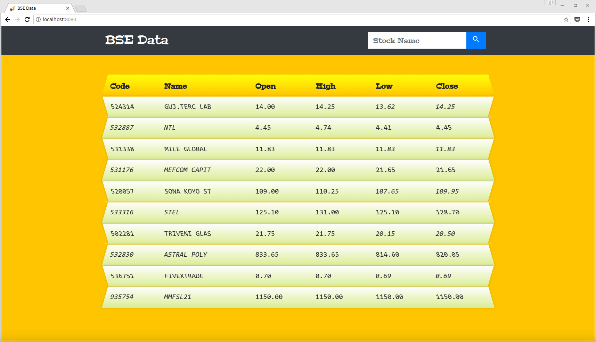

## Daily BSE

This project shows the daily stats issued by BSE by fetching from this URL: http://www.bseindia.com/markets/equity/EQReports/BhavCopyDebt.aspx?expandable=3

The project uses Cherrypy, the python web framework to serve files and redis to store the data which can be queried.

### Steps to get the project up and running:
  - install redis: `sudo apt install redis-server`
  - clone the project
  - `cd` into cloned directory
  - use `pipenv install` to install deps
  - rename .env.sample to .env
  - use `pipenv shell` to activate the virtual env
  - run `python serve.py`
  - goto `localhost:8080` in browser
